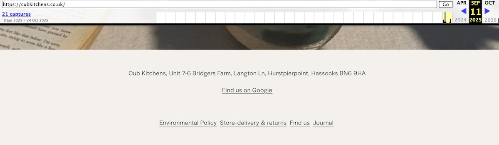
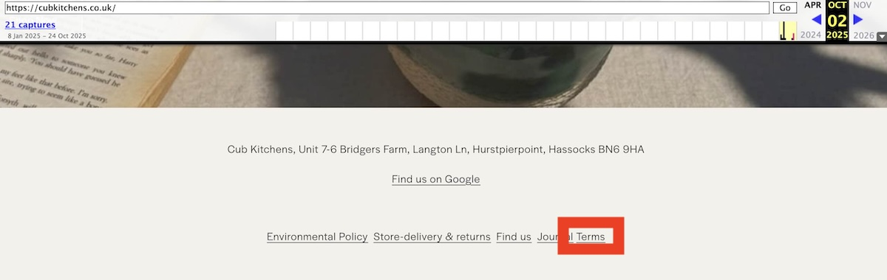

# Cub Kitchens

A number of customers have paid large deposits to Cub Kitchens, oni, and Bearhaus and received nothing in return.

If you're a customer of Cub Kitchens, Cubly, Bearhaus, Load Bear, oni, or any other trading names of [Green 2020 Ltd](https://find-and-update.company-information.service.gov.uk/company/12416577) or [Squirrel Kitchens Ltd](https://find-and-update.company-information.service.gov.uk/company/16450946),
send me an [email](mailto:jdbaldry@gmail.com) or reach out on [Facebook](https://www.facebook.com/jack.baldry.5454).

## Known sites

Green 2020 Ltd and Squirrel Kitchens Ltd have a number of sites.
You can see some of the older site iterations on the [Wayback Machine](https://web.archive.org/).

- <https://cubkitchens.co.uk>: Contact page and Terms left intact.
- <https://madebyoni.com>: Site removed.
- <https://www.bearhaus.co.uk>: Site expired.
- <https://www.loadbear.co.uk>: Site expired.

## CCJs

There are four unsatisfied records outstanding against Green 2020 Ltd.
I'm not allowed to share the report but you can confirm it yourself using [TrustOnline](https://search.trustonline.org.uk/Search/Business).

## Fake reviews

Cub Kitchens posted an AI generated review on [Google Maps](https://maps.app.goo.gl/eCfu9LEjRGwJoddBA) and [Trustpilot](https://www.trustpilot.com/reviews/68eced71f35305802a92430b) to try and offset the negative reviews they've been receiving from customers still waiting for a refund on their undelivered kitchens.

Put the text into any AI checking tool and it will flag it as fake.
You can do the same to all the negative reviews and see that they're all clearly real human experiences.

The Digital Markets, Competition and Consumers Act 2024 makes it illegal to post fake reviews and requires businesses to take reasonable steps to prevent and remove them.
I've notified Cub Kitchens of the fake review and they've insisted it's legitimate.
It seems odd for a legitimate customer to leave an AI generated review with no pictures instead of their own experience.

## Shady social media practices

After waiting patiently for four weeks without meaningful communication indicating any intent to deliver my kitchen, I posted on their social media pages on Facebook and Instagram.
Instead of engaging with the comments, Cub Kitchens deleted my comments and blocked my account.

## Use of retrospective terms and conditions

When I requested a refund, Cub Kitchens quoted their website terms and conditions to me and said that they justified _any_ delays of _any_ length.

I paid a deposit in August and was never shown any terms and conditions.
The terms section of the website was added some time after 11 September but before 2 October and was dated August 2025 to try and look like it was there for longer.

- [Archive 11 September 2025](https://web.archive.org/web/20250911001641/https://cubkitchens.co.uk/)

  

- [Archive 2 October 2025](https://web.archive.org/web/20251002232231/https://cubkitchens.co.uk/)

  

## Winding up petition

There's a winding up petition issued against [Green 2020 Ltd](https://www.thegazette.co.uk/notice/4973248) petitioned by solicitors on behalf of Stark Building Materials (owners of Jewson and other brands).
I attended the hearing which was adjourned to 10 December 2025.
